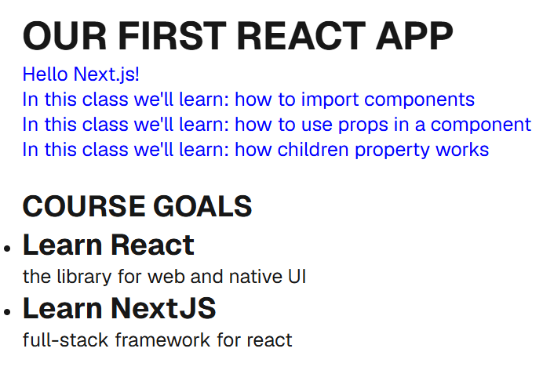

# TO DO : Coding Challenge - Working with Props

Learning Objective: Build and use a reusable CourseGoal component to display a list of your goals for this course.

# Steps

1. In your "components-example" example project (after you completed all steps from previous task), we will add a Course Goal section at the bottom of the page.
2. In the "components" folder create a file named "CourseGoal.jsx"
    - create a function named "CourseGoal" with "export default" before the function keyword.
3. Your task is to make the CourseGoal component reusable / configurable. It should accept a "title" and a "description" input and output the received data as follows:

```jsx
  return <li>
      <h2>{title}</h2>
      <p>{description}</p>
  </li>
```

4. Import your newly created component in the "index.js" file in your "pages" folder with the following
```js
import CourseGoal from '../components/CourseGoal.jsx'
```
5. Then render at least two instances of the CourseGoal component in your "index.js" right below ComponentWrapper from the previous activity.

```jsx
<br/>

<h2>COURSE GOALS</h2>
<ul>
{/* OUTPUT AT LEAST TWO CourseGoal components here */}
{/* One of them can have a title of “Learn React” and a description of “the library for web and native UI” */}
{/* One of them can have a title of “Learn NextJS” and a description of “full-stack framework for react */}
</ul>
```

- The finished app could look like this:
  
  

- But of course, your course goal titles and descriptions are entirely up to you.


Hints:

- Use the props concept to make a component configurable & reusable
- Keep in mind that every component receives a props object - automatically, provided by React
- Set prop values by adding them as key-value pairs (like "custom attributes") on your components when using them in JSX code
- The received props object contains all the "attributes" you set on the component (when using it in JSX code) as properties
